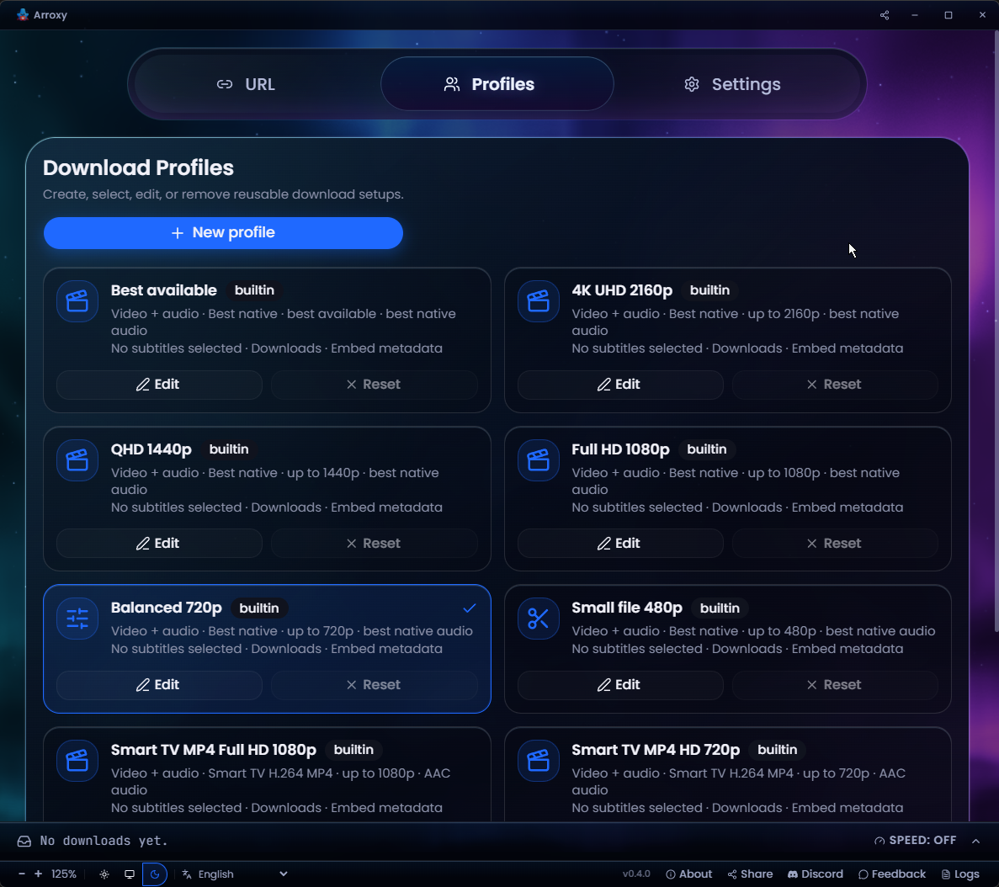
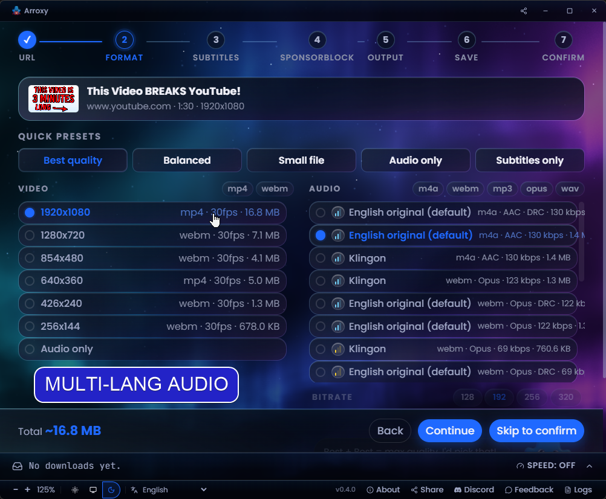
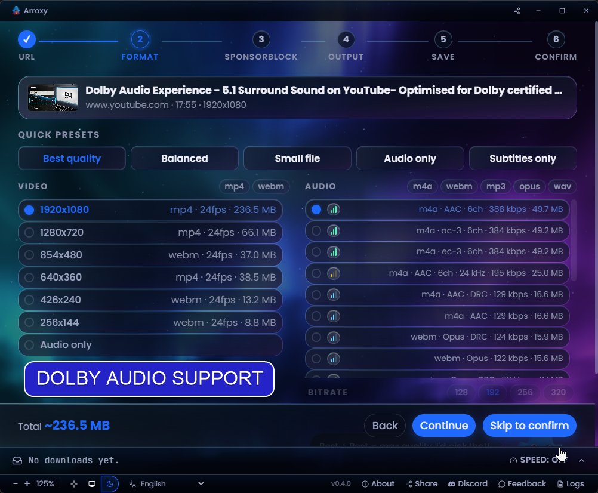
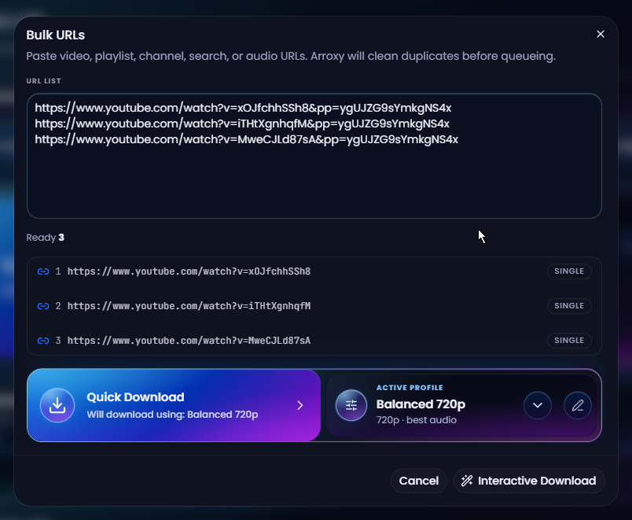

<div align="center">
  

# Arclio — Windows・macOS・Linux 向け無料オープンソース YouTube（+ 2000 サイト）ダウンローダー

**4K · 1080p60 · HDR · Surround/Dolby audio · Playlists · MP3 · Shorts · Music · Channels · Subtitles · SponsorBlock · +2000 sites**

**言語：** [Afaan Oromoo](README.om.md) · [Deutsch](README.de.md) · [English](README.md) · [Español](README.es.md) · [Français](README.fr.md) · [Kiswahili](README.sw.md) · [O'zbekcha](README.uz.md) · [Tiếng Việt](README.vi.md) · [አማርኛ](README.am.md) · [العربية](README.ar.md) · [اردو](README.ur.md) · [پښتو](README.ps.md) · [বাংলা](README.bn.md) · [हिन्दी](README.hi.md) · [မြန်မာဘာသာ](README.my.md) · [Ελληνικά](README.el.md) · [Русский](README.ru.md) · [Српски](README.sr.md) · [Українська](README.uk.md) · [中文](README.zh.md) · **日本語**

[](https://github.com/antonio-orionus/Arclio/releases/latest) [](https://github.com/antonio-orionus/Arclio/actions/workflows/release.yml) [](https://arclio.orionus.dev/)   

**YouTube と 2000 以上の対応サイト**から動画・Shorts・音楽・チャンネル・ポッドキャスト・音声トラックをダウンロード — 最大 4K HDR 60fps、または MP3 / AAC / Opus として。Windows、macOS、Linux でローカル動作。**広告なし、余計なものなし、アップセルなし。**

[**↓ 最新リリースをダウンロード**](#install) &nbsp;·&nbsp; [**ウェブサイト**](https://arclio.orionus.dev/) &nbsp;·&nbsp; [Windows](#install) · [macOS](#install) · [Linux](#install)

[](https://discord.gg/ueGvXwQH8y)


Arclio が役に立ったなら、⭐ で他のユーザーへの周知を助けてください。

</div>

> **What is Arclio?** Arclio is a free, open-source desktop GUI that downloads videos, audio, playlists, and subtitles from YouTube and 2000+ other [yt-dlp](https://github.com/yt-dlp/yt-dlp)-supported sites. It runs on Windows 10/11, macOS 11+ (Intel + Apple Silicon), and Linux (AppImage, Flatpak, tar.gz). MIT licensed. No account, no ads, no usage limits. Distributed via [Winget](https://winget.run/pkg/AntonioOrionus/Arclio), [Scoop](https://github.com/antonio-orionus/scoop-bucket), [Homebrew Cask](https://github.com/antonio-orionus/homebrew-arclio), Flatpak, AppImage, and direct download.
>
> _Last updated: 2026-06-17._

> 🌐 これは AI 翻訳です。[英語版 README](README.md) が情報のソースです。誤りを見つけたら [PR を歓迎します](../../pulls)。

---

## 目次

- [ダウンロード](#install)
- [なぜ Arclio？](#why)
- [機能](#features)
- [プライバシー](#privacy)
- [よくある質問](#faq)
- [ロードマップ](#roadmap)
- [技術詳細](#tech)

---

## <a id="install"></a>ダウンロード

| プラットフォーム | フォーマット                                                                                                                                                                                                                                                                                                                                                                                                                                                                                                                                                                                                                                       |
| ------------------- | ------------------------------------------------------------------------------------------------------------------------------------------------------------------------------------------------------------------------------------------------------------------------------------------------------------------------------------------------------------------------------------------------------------------------------------------------------------------------------------------------------------------------------------------------------------------------------------------------------------------------------------------------------- |
| Windows             | [](https://github.com/antonio-orionus/Arclio/releases/latest/download/Arclio-win-x64-Setup.exe) [](https://github.com/antonio-orionus/Arclio/releases/latest/download/Arclio-win-x64-Portable.exe)                                                                                                                                                                                                        |
| macOS               | [](https://github.com/antonio-orionus/Arclio/releases/latest/download/Arclio-mac-arm64.dmg) [](https://github.com/antonio-orionus/Arclio/releases/latest/download/Arclio-mac-x64.dmg)                                                                                                                                                                                                                     |
| Linux               | [](https://github.com/antonio-orionus/Arclio/releases/latest/download/Arclio-linux-x64.AppImage) [](https://github.com/antonio-orionus/Arclio/releases/latest/download/Arclio-linux-x64.flatpak) [](https://github.com/antonio-orionus/Arclio/releases/latest/download/Arclio-linux-x64.tar.gz) |
| Verify              | [](https://github.com/antonio-orionus/Arclio/releases/latest/download/SHA256SUMS)                                                                                                                                                                                                                                                                                                                                                                                                                                              |

[**最新リリースを入手 →**](https://github.com/antonio-orionus/Arclio/releases/latest)

### <a id="why-warning"></a>警告が表示される理由

Arclio はオープンソースで MIT ライセンスのソフトウェアです。Windows および macOS のビルドは**コード署名されていません** — Apple Developer ID と Windows EV のコード署名証明書はそれぞれ年間数百ドルかかり、個人プロジェクトでは自己負担になります。署名がない場合、Windows SmartScreen と macOS Gatekeeper は初回起動時に警告を表示します。これらの警告は*OS が発行元を認識していない*ことを意味するものであり、Arclio がマルウェアであることを示すものではありません。

自分で Arclio を検証する 3 つの方法（厳密さの高い順）：

- **ソースコードを読む。** すべての行は [GitHub](https://github.com/antonio-orionus/Arclio) にあり、[ソースからビルド](#tech)することもできます。
- **SHA256 を確認する。** ダウンロードしたファイルを公開済みの [`SHA256SUMS`](../../releases/latest) と照合してください — 下記の[ダウンロードの検証](#verify)を参照。
- **サードパーティのスキャンを実行する。** [VirusTotal](https://www.virustotal.com) にファイルをアップロード。

### <a id="windows-first-launch"></a>Windows 初回起動

初回起動時に **«Windows protected your PC»** または **«Unknown publisher»** が表示されることがあります。これは `Arclio-win-x64-Setup.exe` と `Arclio-win-x64-Portable.exe` の両方に該当します。Arclio は無料のオープンソースソフトウェアであり、Windows ビルドには有料の証明書によるコード署名がないため、SmartScreen がフラグを立てます。これは Arclio が危険であることを**自動的に**意味するわけではありません。続行するには：

<div align="center">
  
  
</div>

1. **More info** をクリック。
2. **Run anyway** をクリック。

#### Windows Defender がファイルをフラグまたは削除した場合

Defender のヒューリスティックは、署名されていない NSIS インストーラーや Electron のポータブル版を不審として検出することがあります。Defender が `Arclio-win-x64-Setup.exe` または `Arclio-win-x64-Portable.exe` を隔離した場合は、**Windows Security → Virus & threat protection → Protection history** から復元し、**Manage settings → Add or remove exclusions** で Arclio の実行ファイルを許可リストに追加してください。SmartScreen と同様に、トリガーとなるのは発行元署名の欠如であり、マルウェアの検出ではありません。

> Arclio は必ず公式の GitHub Releases ページからダウンロードしてください。他のウェブサイトから入手したファイルや、誰かから送られてきたファイルは削除し、公式ソースから新しいコピーをダウンロードしてください。ソースコードは公開されているため、ご自身で確認したり、Arclio をビルドしたりすることも可能です。

### <a id="macos-first-launch"></a>macOS 初回起動

Arclio はまだ macOS 向けのコード署名が行われていないため、Gatekeeper が初回起動をブロックします。許可する方法は macOS のバージョンによって異なります — Sequoia 15 では旧来の右クリック → 開く による回避策が制限されました。

#### macOS Sequoia 15 以降（現行）

Sequoia 15 以降では、右クリック → 開く では多くの隔離済みアプリの Gatekeeper をバイパスできなくなりました。代わりにシステム設定パネルを使用してください：

1. マウントした DMG から `Arclio.app` を `/Applications` にドラッグ。
2. Arclio をダブルクリックするとブロックダイアログが表示されます — **Done** をクリック（*Move to Trash* はクリックしない）。
3. **System Settings → Privacy & Security** を開き、**Security** セクションまでスクロール。*"Arclio was blocked to protect your Mac"*（または同様のメッセージ）が表示されます。
4. **Open Anyway** をクリックし、パスワードまたは Touch ID で確認後、`/Applications` から Arclio を再起動してください。

#### macOS Sonoma 14 以前

1. マウントした DMG から `Arclio.app` を `/Applications` にドラッグ。
2. `/Applications` 内の `Arclio.app` を右クリック（または Control-クリック）して **Open** を選択。
3. 警告ダイアログに **Open** ボタンが表示されます — クリックして確認。Arclio が正常に開き、以後警告は表示されません。

#### "App is damaged" または Gatekeeper の継続的なブロック — Terminal による修正

macOS が *"Arclio is damaged and can't be opened"* と表示する場合、または上記の手順でブロックが解除できない場合、原因は DMG の隔離属性です（一部のブラウザや macOS 自体のトランスロケーション動作が設定します）。インストール済みアプリからその属性を削除してください：

```bash
xattr -dr com.apple.quarantine /Applications/Arclio.app
```

**Apple Silicon vs Intel：** M シリーズ Mac（M1 / M2 / M3 / M4）では `arm64` DMG をダウンロード。Intel Mac では `x64` DMG をダウンロード。誤ったビルドも Rosetta 経由で動作しますが、速度は明らかに遅くなります。

> macOS ビルドは Apple Silicon と Intel の CI ランナーで生成されます。問題が発生した場合は [issue を開いて](../../issues) ください — macOS ユーザーからのフィードバックが macOS のテストサイクルを積極的に形成します。

### <a id="linux-first-launch"></a>Linux 初回起動

AppImage はインストール不要で直接実行できます。ファイルを実行可能としてマークするだけです。

**ファイルマネージャー：** `.AppImage` を右クリック → **プロパティ** → **権限** → **プログラムとして実行を許可** を有効化、ダブルクリックで起動。

**ターミナル：**

```bash
chmod +x Arclio-linux-x64.AppImage
./Arclio-linux-x64.AppImage
```

それでも起動しない場合、FUSE が不足している可能性があります：

```bash
# Ubuntu / Debian
sudo apt install -y libfuse2

# Fedora
sudo dnf install -y fuse-libs

# Arch
sudo pacman -S fuse2
```

**省略可能なデスクトップ統合：** [AppImageLauncher](https://github.com/TheAssassin/AppImageLauncher) を一度インストールしておくと、ダブルクリックした AppImage が自動的にランチャーメニューに登録されます — `.desktop` ファイルの手動作成は不要です。

**Flatpak（サンドボックス版）：** 同じリリースページから `Arclio-*.flatpak` をダウンロード。

```bash
flatpak install --user Arclio-linux-x64.flatpak
flatpak run io.github.antonio_orionus.Arclio
```

<details>
<summary><strong><a id="verify"></a>ダウンロードの検証（SHA256）</strong></summary>

各リリースではバイナリと一緒に `SHA256SUMS` ファイルが公開されています。ダウンロードが転送中に破損または改ざんされていないことを確認するには、ファイルをローカルでハッシュ計算し、`SHA256SUMS` の該当行と照合してください。最新リリースページを開き → **Assets** → `SHA256SUMS` をダウンロード。

**Windows (PowerShell or Command Prompt):**

```powershell
certutil -hashfile Arclio-win-x64-Setup.exe SHA256
```

**macOS (Terminal):**

```bash
shasum -a 256 Arclio-mac-arm64.dmg
```

**Linux (Terminal):**

```bash
sha256sum Arclio-linux-x64.AppImage
```

サードパーティのマルウェアスキャンを希望する場合は、[VirusTotal](https://www.virustotal.com) にファイルをアップロードしてください。マイナーなエンジンによる汎用ヒューリスティックの数件の検出は、署名されていない Electron アプリでは通常の範囲内です。主要エンジンによる広範な検出があれば、それは本物の懸念事項です。

</details>

<details>
<summary><strong>パッケージマネージャー経由でインストール</strong></summary>

パッケージマネージャーを使っている場合は、手動ダウンロードのステップを省略できます。

| チャンネル | コマンド                                                                                |
| ------------------ | ------------------------------------------------------------------------------------------------- |
| Winget             | `winget install AntonioOrionus.Arclio`                                                            |
| Scoop              | `scoop bucket add arclio https://github.com/antonio-orionus/scoop-bucket && scoop install arclio` |
| Homebrew           | `brew tap antonio-orionus/arclio && brew install --cask arclio`                                   |
| Flatpak            | `flatpak install --user Arclio-linux-x64.flatpak`                                                 |

</details>

<details>
<summary><strong>Windows：インストーラ vs ポータブル</strong></summary>

|               | NSIS インストーラ | ポータブル `.exe` |
| ------------- | :----------------------: | :---------------------: |
| インストール必要 | はい  | いいえ — どこからでも実行可能  |
| 自動アップデート | ✅ アプリ内  | ❌ 手動ダウンロード  |
| 起動速度 | ✅ 速い  | ⚠️ コールドスタートが遅め  |
| スタートメニューに追加 |            ✅            |           ❌            |
| 簡単アンインストール |            ✅            | ❌ ファイルを削除するだけ  |

**おすすめ：** 自動アップデートと高速起動には NSIS インストーラを使用。インストール不要・レジストリ非変更のオプションにはポータブル `.exe` を使用。

</details>

---

## <a id="why"></a>なぜ Arclio？

最もよく使われる代替手段との比較：

|            | Arclio | 4K Video Downloader | JDownloader | Y2Mate / online converters | Browser extensions |
| ---------- | :----: | :-----------------: | :---------: | :------------------------: | :----------------: |
| 無料、プレミアム層なし |   ✅   |         ⚠️          |     ✅      |             ⚠️             |         ⚠️         |
| オープンソース |   ✅   |         ❌          |     ❌      |             ❌             |         ⚠️         |
| ローカル処理のみ |   ✅   |         ✅          |     ✅      |             ❌             |         ✅         |
| ログイン・Cookie エクスポート不要 |   ✅   |         ⚠️          |     ⚠️      |             ⚠️             |         ✅         |
| 利用回数制限なし |   ✅   |         ⚠️          |     ✅      |             🚫             |         ⚠️         |
| クロスプラットフォームのデスクトップアプリ |   ✅   |         ✅          |     ✅      |            N/A             |         ❌         |
| 字幕 + SponsorBlock |   ✅   |         ⚠️          |     ❌      |             ❌             |         ❌         |

Arclio はひとつのことのために作られています：URL を貼って、クリーンなローカルファイルを得る。アカウントなし、アップセルなし、データ収集なし。

---

## <a id="features"></a>機能

### 画質・フォーマット

- 最大 **4K UHD（2160p）**、1440p、1080p、720p、480p、360p
- **ハイフレームレート**をそのまま保存 — 60 fps、120 fps、HDR
- **音声** — 音声のみを MP3、M4A/AAC、Opus、WAV で書き出します。インタラクティブなダウンロードでは、利用可能な場合にソースのネイティブ サラウンド/Dolby トラック（AC-3、E-AC-3、5.1、DRC）を選択でき、グローバルな既定値 **サラウンド / Dolby を優先** を設定できます
- クイックプリセット：*最高画質* · *バランス* · *小さいファイル*

### プライバシー・制御

- 100% ローカル処理 — ダウンロードは YouTube から直接あなたのディスクへ
- ログインなし、Cookie なし、Google アカウント連携なし
- 選択したフォルダに直接ファイルを保存

### ワークフロー

- **柔軟な開始モード** — ガイド付き単体ダウンロード、プレイリスト/チャンネル選択、URL一括貼り付け、保存済み既定値での Quick Download を選べます
- **中央ダウンロードキュー** — 単体、プレイリスト、一括、クイックの各ジョブが一か所に入り、進行状況、一時停止、再開、キャンセル、再試行、優先度を管理できます
- **クリップボード監視** — YouTube リンクをコピーすると、アプリにフォーカスを戻したときに Arclio が URL を自動入力（詳細設定でトグル切替可能）
- **URL 自動クリーンアップ** — トラッキングパラメータ（`si`、`pp`、`utm_*`、`fbclid`、`gclid`）を除去し、`youtube.com/redirect` リンクを展開
- **トレイモード** — ウィンドウを閉じてもダウンロードはバックグラウンドで継続
- **21 言語対応** — システムロケールを自動検出、いつでも切替可能
- **プレイリスト同期** — ローカルフォルダーと照合してプレイリストを再スキャンし、ダウンロード済みの動画をスキップします。各動画のダウンロードに合わせて更新される `.m3u` プレイリストファイルも生成します
- **速度とペーシング制御** — ダウンロード帯域を制限し、リクエスト間の待機を追加し、プリセット（*オフ · バランス · 慎重 · カスタム*）でフラグメントスレッドを調整できます

### 字幕・後処理

- SRT、VTT、または ASS 形式の**字幕** — 手動または自動生成、利用可能な任意の言語
- 動画の隣に保存、`.mkv` に埋め込み、または `Subtitles/` サブフォルダに整理
- **SponsorBlock** — スポンサー、イントロ、アウトロ、自己宣伝をスキップまたはチャプターマーク
- **埋め込みメタデータ** — タイトル、アップロード日、チャンネル、説明、サムネイル、チャプターマーカーをファイルに書き込み

### YouTube + 2000 サイト

- **YouTube、フル対応** — 動画・Shorts・チャンネル・プレイリスト・YouTube Music・ポッドキャストをファーストクラスのソースとして処理
- **2000 以上の他サイト** via yt-dlp — Vimeo、Twitch、Twitter/X、TikTok、SoundCloud、Bandcamp、Bilibili、BBC iPlayer、archive.org など多数
- **音声のみと字幕**は YouTube だけでなく、すべての対応サイトで機能します
- サイトが変更されても、yt-dlp は毎週修正をリリースし、Arclio は起動時にバイナリを自動更新します

<table align="center" width="100%">
  <tr>
    <td width="50%" valign="top" align="center"><br/><sub><b>クイックダウンロードのホーム</b><br/>URLを貼り付け、アクティブなプロファイルですぐにダウンロード</sub></td>
    <td width="50%" valign="top" align="center"><br/><sub><b>再利用できるダウンロードプロファイル</b><br/>形式・画質・出力をプリセットとして保存——ダウンロードごとに再利用</sub></td>
  </tr>
  <tr>
    <td width="50%" valign="top" align="center"><br/><sub><b>多言語の音声トラック</b><br/>動画が持つ音声言語を正確に選択</sub></td>
    <td width="50%" valign="top" align="center"><br/><sub><b>サラウンド / Dolby 音声</b><br/>5.1 と Dolby のトラックを検出して保持</sub></td>
  </tr>
  <tr>
    <td width="50%" valign="top" align="center"><br/><sub><b>一括URLモード</b><br/>リストを貼り付け、自動で重複を除去し、まとめてキューに追加</sub></td>
    <td width="50%" valign="top" align="center"><br/><sub><b>並列ダウンロードキュー</b><br/>複数のダウンロードを同時に、進捗をリアルタイム表示</sub></td>
  </tr>
</table>

---

## <a id="privacy"></a>プライバシー

ダウンロードは [yt-dlp](https://github.com/yt-dlp/yt-dlp) 経由で YouTube から選択したフォルダへ直接取得されます — サードパーティのサーバーは経由しません。視聴履歴、ダウンロード履歴、URL、ファイルの内容はすべてあなたのデバイスに留まります。

Arclio は [OpenPanel](https://openpanel.dev) 経由で匿名・集計されたテレメトリーを送信します — 起動数、OS、アプリバージョン、クラッシュを把握するための最低限だけです。URL、動画タイトル、ファイルパス、アカウント情報、フィンガープリンティング、個人データはありません。インストールごとの ID はランダムで、あなたの身元には結びつきません。設定からオプトアウトできます。

---

## <a id="faq"></a>よくある質問

**本当に無料ですか？**
はい — MIT ライセンス、プレミアム層なし、機能ゲートなし。

**どの動画品質をダウンロードできますか？**
YouTube が提供するすべて：4K UHD（2160p）、1440p、1080p、720p、480p、360p、音声のみ。60 fps、120 fps、HDR ストリームはそのまま保存されます。

**音声を MP3 として抽出できますか？**
はい。形式メニューで*音声のみ*を選び、MP3、M4A/AAC、Opus、WAV を選択できます。

**YouTube アカウントや Cookie が必要ですか？**
デフォルトでは不要です — Arclio は YouTube アカウント、ログイン、Cookie のエクスポートなしで動作します。年齢制限付きやメンバー限定動画など、認証が必要なコンテンツのために、詳細設定にオプションの Cookie サポート（Cookies source: file or browser）が用意されています。デフォルトはオフです。有効化する場合、yt-dlp の wiki は [Cookie ベースの自動化が Google アカウントにフラグを立てる可能性がある](https://github.com/yt-dlp/yt-dlp/wiki/Extractors#exporting-youtube-cookies) と注意しています。その場合は使い捨てアカウントの利用が安全です。

**YouTube が変更したら使えなくなりますか？**
yt-dlp は起動時に自動更新され、YouTube に変更があれば Arclio も迅速に修正をリリースします。万が一問題が発生した場合は、フォールバックとして詳細設定にオプションの Cookie サポートが用意されています。

**Arclio は何言語に対応していますか？**
21 言語に標準対応：English、Español（スペイン語）、Deutsch（ドイツ語）、Français（フランス語）、日本語、中文（中国語）、Русский（ロシア語）、Українська（ウクライナ語）、हिन्दी（ヒンディー語）、Afaan Oromoo、Kiswahili、O'zbekcha（ウズベク語）、Tiếng Việt（ベトナム語）、አማርኛ（アムハラ語）、العربية（アラビア語）、اردو（ウルドゥー語）、پښتو（パシュトー語）、বাংলা（ベンガル語）、မြန်မာဘာသာ（ビルマ語）、Ελληνικά（ギリシャ語）、Српски（セルビア語）。Arclio は初回起動時に OS の言語を自動検出し、ツールバーの言語選択でいつでも切り替え可能です。実行時のロケール JSON は src/shared/i18n/locales/ にあり、翻訳者向けの PO カタログは i18n/locales/ にあります。貢献するには GitHub で PR を開いてください。

**他に何かインストールが必要ですか？**
いいえ。yt-dlp は初回起動時に自動ダウンロードされてマシンにキャッシュされます。ffmpeg と ffprobe はアプリに同梱されています。それ以降は追加のセットアップ不要です。

**プレイリストやチャンネル全体をダウンロードできますか？**
はい、どちらも対応しています。プレイリストまたはチャンネルのURL（例: `youtube.com/@handle`, `/channel/UC…`, `/c/Name`, `/user/Old`）を貼り付け、スキャンする件数を選んでから、リスト全体をキューに入れるか特定の動画を選べます。日付範囲フィルターは近日対応予定です。

**macOS で「アプリが壊れている」と表示される — どうすれば？**
それは macOS Gatekeeper が未署名のアプリをブロックしているもので、実際の破損ではありません。["App is damaged" — Terminal による修正](#macos-first-launch) を参照してください — 1 行の `xattr` コマンドで解決できます。

**YouTube の動画をダウンロードするのは合法ですか？**
個人的・私的利用については、ほとんどの法域で一般的に容認されています。YouTube の[利用規約](https://www.youtube.com/t/terms)およびあなたの地域の著作権法への準拠はあなた自身の責任です。

---

## <a id="roadmap"></a>ロードマップ

引き続き予定されている機能 — おおよその優先順位順：

| 機能    | 説明    |
| ---------------- | ---------------- |
| **プレイリスト・チャンネルのフィルター** | プレイリストまたはチャンネルの列挙時の日付範囲フィルター |
| **YouTube 音声トラックの優先設定** | YouTube が複数の音声トラックを提供する場合に、アプリ全体の優先言語トラックを設定し、プロファイルごとに上書き |
| **アプリ内ブラウザーサインイン** | Arclio 内でブラウザーウィンドウを開き、手動で cookies をエクスポートせずにサインインしてサイト cookies を使用 |
| **ワンクリック動画ダウンロード** | 検出または貼り付けた URL から、アクティブなプロファイルで動画ダウンロードをワンクリック開始 |
| **より強いリトライ復旧** | 不安定または問題のあるインターネット接続で中断されたダウンロード向けの新しいリトライ経路 |
| **本格的なダウンロードマネージャードロワー** | キュードロワーをより完全なマネージャーへ拡張し、キュー内アイテムの保存先フォルダー変更にも対応 |
| **スケジュールダウンロード** | 設定した時刻にキューを開始（夜間実行など） |
| **クリップトリミング** | 開始・終了時刻でセグメントのみをダウンロード |

機能のアイデアがありますか？[リクエストを開いてください](../../issues) — コミュニティの意見が優先順位を決めます。

---

## <a id="tech"></a>技術詳細

<details>
<summary><strong>スタック</strong></summary>

- **Electron** — クロスプラットフォームのデスクトップシェル
- **React 19** + **TypeScript** — UI
- **Tailwind CSS v4** — スタイリング
- **Zustand** — 状態管理
- **yt-dlp** + **ffmpeg** — ダウンロード・マルチプレクサエンジン（yt-dlp は実行時に取得、ffmpeg/ffprobe はビルド時に同梱）
- **Vite** + **electron-vite** — ビルドツール
- **Vitest** + **Playwright** — ユニットテスト・E2E テスト

</details>

<details>
<summary><strong>ソースからビルド</strong></summary>

### 前提条件 — 全プラットフォーム共通

| ツール  | バージョン | インストール |
| ------- | ------- | ------- |
| Git     | 任意    | [git-scm.com](https://git-scm.com) |
| Node.js | 24.16.0 | `mise install` または `.node-version` |
| Bun     | 1.2.23  | `mise install` または `package.json` `packageManager` |

推奨: `mise` をインストールし、checkout 内で `mise install` を実行します。mise を使わない場合は、`bun run bootstrap` の前に `.node-version` の Node.js と `package.json` の Bun を手動で有効化してください。

### Windows

```powershell
powershell -c "irm bun.sh/install.ps1 | iex"
```

ネイティブ rebuild には Visual Studio Build Tools と Python が必要になる場合があります。

### macOS

```bash
xcode-select --install
curl -fsSL https://bun.sh/install | bash
```

### Linux（Ubuntu / Debian）

```bash
curl -fsSL https://bun.sh/install | bash

# ビルド + Electron ランタイム依存
sudo apt install -y build-essential python3 tar libgtk-3-0 libnss3 libasound2t64

# E2E テストのみ（Electron にはディスプレイが必要）
sudo apt install -y xvfb
```

### クローンして実行

```bash
git clone https://github.com/antonio-orionus/Arclio
cd Arclio
mise install           # 推奨。固定バージョンのツールを手動で有効化済みならスキップ
bun run bootstrap
bun run doctor
bun run dev            # Vite renderer に接続した Electron アプリ
```

### 配布パッケージのビルド

```bash
bun run build        # 型チェック + コンパイル
bun run dist         # 現在の OS 向けパッケージ
bun run dist:win     # 対応ホストで Windows ターゲットをパッケージ
```

> `bun run bootstrap` は依存関係をインストールし、Electron アプリ依存を rebuild し、Electron を検証し、開発用の埋め込み ffmpeg/ffprobe を準備し、Playwright Chromium をインストールします。yt-dlp は実行時にアプリデータフォルダで管理され、ffmpeg と ffprobe はすべての Arclio リリースに同梱されています。

</details>

---

## <a id="troubleshooting"></a>Troubleshooting

### App won't open / no window appears

The Arclio process starts but no window shows up. Most often this is a GPU driver hang during startup. Try, in order:

**1. Check the log.** It records startup, GPU info, and any crash. Path:

| Platform | Path                             |
| -------- | -------------------------------- |
| Windows  | `%APPDATA%\Arclio\logs\main.log` |
| macOS    | `~/Library/Logs/Arclio/main.log` |
| Linux    | `~/.config/Arclio/logs/main.log` |

**2. Launch with hardware acceleration disabled.** Open a terminal / Command Prompt and run the executable with a flag:

```bash
# Windows (Portable) — PowerShell, run from the folder containing the exe
.\Arclio-win-x64-Portable.exe --disable-gpu

# Windows (Portable) — Command Prompt (cmd.exe), from the same folder
Arclio-win-x64-Portable.exe --disable-gpu

# Windows (Installed) — works in both PowerShell and cmd.exe
"%LOCALAPPDATA%\Programs\Arclio\Arclio.exe" --disable-gpu

# macOS
/Applications/Arclio.app/Contents/MacOS/Arclio --disable-gpu

# Linux (AppImage)
./Arclio-linux-x64.AppImage --disable-gpu
```

If that works, the GPU/driver is the cause. Make the change permanent (next step).

**3. Persist the flag via `argv.json`.** Create the file at:

| Platform | Path                                             |
| -------- | ------------------------------------------------ |
| Windows  | `%APPDATA%\Arclio\argv.json`                     |
| macOS    | `~/Library/Application Support/Arclio/argv.json` |
| Linux    | `~/.config/Arclio/argv.json`                     |

With contents:

```json
{ "disable-hardware-acceleration": true }
```

Arclio reads this before opening any window, so it works even when the window never appeared.

**4. Other flags worth trying** (combine if needed): `--disable-software-rasterizer`, `--disable-gpu-sandbox`, `--in-process-gpu`.

**5. Stale window position.** If the window may be opening off-screen (multi-monitor change since last run), delete `<userData>\window-state.json` and relaunch.

**6. Still stuck?** Open an issue with: OS version, the contents of `main.log`, and any output from running with `--enable-logging --v=1`.

---

## 利用規約

Arclio は個人的・私的利用のみを目的としたツールです。ダウンロードが YouTube の[利用規約](https://www.youtube.com/t/terms)およびあなたの法域の著作権法に準拠することはあなた自身の責任です。権利を持たないコンテンツのダウンロード・複製・配布に Arclio を使用しないでください。開発者は誤用に対して一切の責任を負いません。

## Star History

<a href="https://www.star-history.com/?repos=antonio-orionus%2FArclio&type=timeline&legend=top-left">
 <picture>
   <source media="(prefers-color-scheme: dark)" srcset="https://api.star-history.com/chart?repos=antonio-orionus/Arclio&type=timeline&theme=dark&legend=top-left" />
   <source media="(prefers-color-scheme: light)" srcset="https://api.star-history.com/chart?repos=antonio-orionus/Arclio&type=timeline&legend=top-left" />
   
 </picture>
</a>

<div align="center">
  <sub>MIT ライセンス · <a href="https://x.com/OrionusAI">@OrionusAI</a> が心を込めて制作</sub>
</div>
