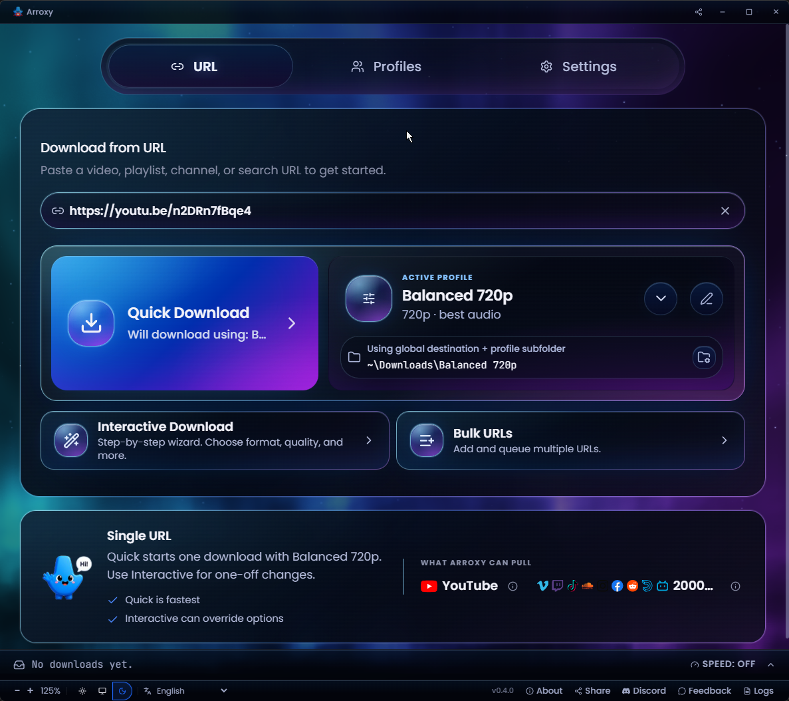

<div align="center">
  

# Arroxy — Windows، macOS اور Linux کے لیے مفت اوپن سورس YouTube ڈاؤن لوڈر

**4K · 1080p60 · HDR · Playlists · MP3 · Shorts · Subtitles · SponsorBlock**

**زبان:** [Afaan Oromoo](README.om.md) · [Deutsch](README.de.md) · [English](README.md) · [Español](README.es.md) · [Français](README.fr.md) · [Kiswahili](README.sw.md) · [O'zbekcha](README.uz.md) · [Tiếng Việt](README.vi.md) · [አማርኛ](README.am.md) · [العربية](README.ar.md) · **اردو** · [پښتو](README.ps.md) · [বাংলা](README.bn.md) · [हिन्दी](README.hi.md) · [မြန်မာဘာသာ](README.my.md) · [Ελληνικά](README.el.md) · [Русский](README.ru.md) · [Српски](README.sr.md) · [Українська](README.uk.md) · [中文](README.zh.md) · [日本語](README.ja.md)

[](https://github.com/antonio-orionus/Arroxy/releases/latest) [](https://github.com/antonio-orionus/Arroxy/actions/workflows/release.yml) [](https://arroxy.orionus.dev/)   

کوئی بھی YouTube ویڈیو، Short یا آڈیو ٹریک اصل کوالٹی میں ڈاؤن لوڈ کریں — 60 fps پر 4K HDR تک، یا MP3 / AAC / Opus کے طور پر۔ Windows، macOS اور Linux پر مقامی طور پر چلتا ہے۔ **کوئی اشتہارات نہیں، کوئی لاگ ان نہیں، کوئی براؤزر کوکیز نہیں، کوئی Google اکاؤنٹ منسلک نہیں۔**

[**↓ تازہ ترین ریلیز ڈاؤن لوڈ کریں**](../../releases/latest) &nbsp;·&nbsp; [**ویب سائٹ**](https://arroxy.orionus.dev/) &nbsp;·&nbsp; [Windows](#download) · [macOS](#download) · [Linux](#download)


اگر Arroxy آپ کا وقت بچاتا ہے، تو ایک ⭐ دوسروں کو اسے ڈھونڈنے میں مدد کرتا ہے۔

</div>

> 🌐 یہ AI کی مدد سے کیا گیا ترجمہ ہے۔ [انگریزی README](README.md) سچائی کا ماخذ ہے۔ کوئی غلطی نظر آئی؟ [PR کا خیر مقدم ہے](../../pulls)۔

---

## فہرست

- [Arroxy کیوں](#why)
- [کوئی کوکیز نہیں، کوئی لاگ ان نہیں، کوئی اکاؤنٹ منسلک نہیں](#no-cookies)
- [خصوصیات](#features)
- [ڈاؤن لوڈ](#download)
- [پرائیویسی](#privacy)
- [اکثر پوچھے گئے سوالات](#faq)
- [روڈ میپ](#roadmap)
- [ان چیزوں سے بنایا گیا](#tech)

---

## <a id="why"></a>Arroxy کیوں

سب سے عام متبادل کے ساتھ ساتھ ساتھ موازنہ:

|            | Arroxy | 4K Video Downloader | JDownloader | Y2Mate / online converters | Browser extensions |
| ---------- | :----: | :-----------------: | :---------: | :------------------------: | :----------------: |
| مفت، کوئی پریمیم سطح نہیں |   ✅   |         ⚠️          |     ✅      |             ⚠️             |         ⚠️         |
| اوپن سورس |   ✅   |         ❌          |     ❌      |             ❌             |         ⚠️         |
| صرف مقامی پراسیسنگ |   ✅   |         ✅          |     ✅      |             ❌             |         ✅         |
| کوئی لاگ ان یا کوکی ایکسپورٹ نہیں |   ✅   |         ⚠️          |     ⚠️      |             ⚠️             |         ✅         |
| استعمال کی کوئی حد نہیں |   ✅   |         ⚠️          |     ✅      |             🚫             |         ⚠️         |
| کراس پلیٹ فارم ڈیسک ٹاپ ایپ |   ✅   |         ✅          |     ✅      |            N/A             |         ❌         |
| سب ٹائٹلز + SponsorBlock |   ✅   |         ⚠️          |     ❌      |             ❌             |         ❌         |

Arroxy ایک ہی کام کے لیے بنایا گیا ہے: URL پیسٹ کریں، ایک صاف ستھری مقامی فائل حاصل کریں۔ کوئی اکاؤنٹس نہیں، کوئی اپ سیلز نہیں، کوئی ڈیٹا کلیکشن نہیں۔

---

## <a id="no-cookies"></a>کوئی کوکیز نہیں، کوئی لاگ ان نہیں، کوئی اکاؤنٹ منسلک نہیں

یہی سب سے عام وجہ ہے کہ ڈیسک ٹاپ YouTube ڈاؤن لوڈرز خراب ہو جاتے ہیں — اور Arroxy کے وجود کی بنیادی وجہ بھی یہی ہے۔

جب YouTube اپنا بوٹ ڈٹیکشن اپ ڈیٹ کرتا ہے، تو زیادہ تر ٹولز آپ کو ایک حل کے طور پر اپنے براؤزر کی YouTube کوکیز ایکسپورٹ کرنے کا کہتے ہیں۔ اس میں دو مسائل ہیں:

1. ایکسپورٹ کیے گئے سیشنز عام طور پر تقریباً 30 منٹ میں ختم ہو جاتے ہیں، لہٰذا آپ کو بار بار ایکسپورٹ کرنا پڑتا ہے۔
2. yt-dlp کی اپنی دستاویزات [خبردار کرتی ہیں کہ کوکی پر مبنی آٹومیشن آپ کے Google اکاؤنٹ کو فلیگ کر سکتی ہے](https://github.com/yt-dlp/yt-dlp/wiki/Extractors#exporting-youtube-cookies)۔

**Arroxy کبھی کوکیز، لاگ ان یا کوئی کریڈنشل نہیں مانگتا۔** یہ صرف وہی پبلک ٹوکنز استعمال کرتا ہے جو YouTube کسی بھی براؤزر کو دیتا ہے۔ آپ کی Google شناخت سے کچھ بھی منسلک نہیں، کچھ ختم ہونے والا نہیں، کچھ روٹیٹ کرنے والا نہیں۔

---

## <a id="features"></a>خصوصیات

### کوالٹی اور فارمیٹس

- **4K UHD (2160p)** تک، 1440p، 1080p، 720p، 480p، 360p
- **ہائی فریم ریٹ** جیسا ہے ویسا ہی محفوظ — 60 fps، 120 fps، HDR
- **صرف آڈیو** کو MP3، M4A/AAC، Opus یا WAV میں ایکسپورٹ کریں
- فوری پری سیٹس: *بہترین کوالٹی* · *متوازن* · *چھوٹی فائل*

### پرائیویسی اور کنٹرول

- 100% مقامی پراسیسنگ — ڈاؤن لوڈز سیدھے YouTube سے آپ کی ڈسک پر جاتے ہیں
- کوئی لاگ ان نہیں، کوئی کوکیز نہیں، کوئی Google اکاؤنٹ منسلک نہیں
- فائلیں سیدھی آپ کے منتخب کردہ فولڈر میں محفوظ

### ورک فلو

- **کوئی بھی YouTube URL پیسٹ کریں** — ویڈیوز، Shorts اور playlists سپورٹڈ ہیں؛ پوری playlist ڈاؤن لوڈ کریں یا پہلے مخصوص ویڈیوز منتخب کریں
- **ملٹی ڈاؤن لوڈ قطار** — کئی ڈاؤن لوڈز کو متوازی طور پر ٹریک کریں
- **کلپ بورڈ واچ** — YouTube لنک کاپی کریں اور جب آپ ایپ پر واپس آئیں تو Arroxy خود بخود URL بھر دیتا ہے (ایڈوانسڈ سیٹنگز میں ٹوگل کریں)
- **خودکار صاف URLs** — ٹریکنگ پیرامیٹرز (`si`، `pp`، `utm_*`، `fbclid`، `gclid`) کو ہٹاتا ہے اور `youtube.com/redirect` لنکس کو کھولتا ہے
- **ٹرے موڈ** — ونڈو بند کرنے سے ڈاؤن لوڈز پس منظر میں چلتے رہتے ہیں
- **21 زبانیں** — سسٹم لوکیل کو خود بخود پہچانتا ہے، کسی بھی وقت تبدیل کیا جا سکتا ہے

### سب ٹائٹلز اور پوسٹ پراسیسنگ

- **سب ٹائٹلز** SRT، VTT یا ASS میں — دستی یا خود کار طریقے سے بنائے گئے، کسی بھی دستیاب زبان میں
- ویڈیو کے ساتھ محفوظ کریں، `.mkv` میں ایمبیڈ کریں، یا `Subtitles/` سب فولڈر میں منظم کریں
- **SponsorBlock** — اسپانسرز، انٹروز، آؤٹروز اور سیلف پروموز کو سکپ کریں یا چیپٹر مارک کریں
- **ایمبیڈڈ میٹا ڈیٹا** — ٹائٹل، اپ لوڈ کی تاریخ، چینل، تفصیل، تھمب نیل اور چیپٹر مارکرز فائل میں لکھے جاتے ہیں

<div align="center">
  
  
  <br/>
  
  
  <br/>
  
</div>

---

## <a id="download"></a>ڈاؤن لوڈ

| پلیٹ فارم | فارمیٹ   |
| ------------------- | ------------------- |
| Windows             | انسٹالر (NSIS) یا پورٹیبل `.exe`   |
| macOS               | `.dmg` (Intel + Apple Silicon)   |
| Linux               | `.AppImage` یا `.flatpak` (سینڈ باکسڈ) |

[**تازہ ترین ریلیز حاصل کریں →**](../../releases/latest)

### پیکج مینیجر کے ذریعے انسٹال کریں

| چینل | کمانڈ                                                                                |
| ------------------ | ------------------------------------------------------------------------------------------------- |
| Winget             | `winget install AntonioOrionus.Arroxy`                                                            |
| Scoop              | `scoop bucket add arroxy https://github.com/antonio-orionus/scoop-bucket && scoop install arroxy` |
| Homebrew           | `brew tap antonio-orionus/arroxy && brew install --cask arroxy`                                   |

<details>
<summary><strong>Windows: انسٹالر بمقابلہ پورٹیبل</strong></summary>

|               | NSIS انسٹالر | پورٹیبل `.exe` |
| ------------- | :----------------------: | :---------------------: |
| انسٹالیشن ضروری | ہاں  | نہیں — کہیں سے بھی چلائیں  |
| خودکار اپ ڈیٹس | ✅ ایپ کے اندر  | ❌ دستی ڈاؤن لوڈ  |
| اسٹارٹ اپ سپیڈ | ✅ تیز  | ⚠️ کولڈ اسٹارٹ سست  |
| اسٹارٹ مینو میں شامل |            ✅            |           ❌            |
| آسان ان انسٹال |            ✅            | ❌ بس فائل ڈیلیٹ کر دیں  |

**تجویز:** خودکار اپ ڈیٹس اور تیز اسٹارٹ اپ کے لیے NSIS انسٹالر استعمال کریں۔ بغیر انسٹالیشن، بغیر رجسٹری آپشن کے لیے پورٹیبل `.exe` استعمال کریں۔

**Windows SmartScreen وارننگ**

پہلی بار لانچ پر آپ کو **"Windows protected your PC"** یا **"Unknown publisher"** نظر آ سکتا ہے۔ یہ `Arroxy-Setup-*.exe` اور `Arroxy-Portable-*.exe` دونوں پر لاگو ہوتا ہے۔ Arroxy مفت اور اوپن سورس ہے اور Windows بلڈز کو ادائیگی والے سرٹیفکیٹ سے کوڈ سائن نہیں کیا گیا، اسی لیے SmartScreen انہیں فلیگ کرتا ہے۔ اس کا مطلب **نہیں** کہ Arroxy خود بخود غیر محفوظ ہے۔ جاری رکھنے کے لیے:

1. **More info** پر کلک کریں۔
2. **Run anyway** پر کلک کریں۔

> Arroxy صرف آفیشل GitHub Releases صفحے سے ڈاؤن لوڈ کریں۔ اگر آپ کو فائل کسی دوسری ویب سائٹ سے ملی ہے یا کسی نے بھیجی ہے، تو اسے ڈیلیٹ کریں اور آفیشل ماخذ سے تازہ کاپی ڈاؤن لوڈ کریں۔ سورس کوڈ عوامی ہے، اس لیے آپ خود اسے جانچ یا Arroxy بنا سکتے ہیں۔

</details>

<details>
<summary><strong>macOS پر پہلی بار لانچ</strong></summary>

Arroxy ابھی کوڈ سائنڈ نہیں ہے، اس لیے macOS Gatekeeper پہلی بار لانچ پر آپ کو تنبیہ کرے گا۔ یہ متوقع ہے — یہ نقصان کی علامت نہیں۔

**سسٹم سیٹنگز کا طریقہ (تجویز کردہ):**

1. Arroxy ایپ آئیکن پر دائیں کلک کریں اور **Open** منتخب کریں۔
2. تنبیہی ڈائیلاگ ظاہر ہوگا — **Cancel** پر کلک کریں (*Move to Trash* پر کلک نہ کریں)۔
3. **System Settings → Privacy & Security** کھولیں۔
4. **Security** سیکشن تک اسکرول کریں۔ آپ کو نظر آئے گا *"Arroxy was blocked from use because it is not from an identified developer."*
5. **Open Anyway** پر کلک کریں اور اپنے پاس ورڈ یا Touch ID سے تصدیق کریں۔

مرحلہ 5 کے بعد، Arroxy عام طور پر کھلتا ہے اور تنبیہ پھر کبھی ظاہر نہیں ہوتی۔

**ٹرمینل کا طریقہ (ایڈوانسڈ):**

```bash
xattr -dr com.apple.quarantine /Applications/Arroxy.app
```

> macOS بلڈز Apple Silicon اور Intel رنرز پر CI کے ذریعے تیار کیے جاتے ہیں۔ اگر آپ کو مسائل پیش آئیں، تو براہ کرم [ایک issue کھولیں](../../issues) — macOS صارفین سے ملنے والی فیڈ بیک macOS ٹیسٹنگ سائیکل کو فعال طور پر تشکیل دیتی ہے۔

</details>

<details>
<summary><strong>Linux پر پہلی بار لانچ</strong></summary>

AppImages براہ راست چلتے ہیں — کوئی انسٹالیشن نہیں۔ آپ کو صرف فائل کو ایگزیکیوٹیبل مارک کرنا ہوگا۔

**فائل مینیجر:** `.AppImage` پر دائیں کلک کریں → **Properties** → **Permissions** → **Allow executing file as program** کو فعال کریں، پھر ڈبل کلک کریں۔

**ٹرمینل:**

```bash
chmod +x Arroxy-*.AppImage
./Arroxy-*.AppImage
```

اگر لانچ پھر بھی ناکام ہو جائے، تو شاید آپ کے پاس FUSE نہیں ہے:

```bash
# Ubuntu / Debian
sudo apt install -y libfuse2

# Fedora
sudo dnf install -y fuse-libs

# Arch
sudo pacman -S fuse2
```

**Flatpak (سینڈ باکسڈ متبادل):** اسی ریلیز پیج سے `Arroxy-*.flatpak` ڈاؤن لوڈ کریں۔

```bash
flatpak install --user Arroxy-*.flatpak
flatpak run io.github.antonio_orionus.Arroxy
```

</details>

---

## <a id="privacy"></a>پرائیویسی

ڈاؤن لوڈز [yt-dlp](https://github.com/yt-dlp/yt-dlp) کے ذریعے براہ راست YouTube سے آپ کے منتخب کردہ فولڈر میں آتے ہیں — کسی تھرڈ پارٹی سرور سے نہیں گزرتے۔ دیکھنے کی تاریخ، ڈاؤن لوڈ تاریخ، URLs اور فائل کے مواد آپ کے ڈیوائس پر ہی رہتے ہیں۔

Arroxy [OpenPanel](https://openpanel.dev) کے ذریعے گمنام، مجموعی ٹیلی میٹری بھیجتا ہے — صرف اتنی کہ لانچز، OS، ایپ ورژنز اور کریشز سمجھ آ سکیں۔ کوئی URLs، ویڈیو ٹائٹلز، فائل پاتھز، اکاؤنٹ معلومات، fingerprinting یا ذاتی ڈیٹا نہیں۔ ہر انسٹال کا ID رینڈم ہے اور آپ کی شناخت سے منسلک نہیں۔ آپ Settings میں اسے بند کر سکتے ہیں۔

---

## <a id="faq"></a>اکثر پوچھے گئے سوالات

**کیا یہ واقعی مفت ہے؟**
ہاں — MIT لائسنس یافتہ، کوئی پریمیم سطح نہیں، کوئی فیچر گیٹنگ نہیں۔

**میں کن ویڈیو کوالٹیز میں ڈاؤن لوڈ کر سکتا ہوں؟**
جو بھی YouTube فراہم کرتا ہے: 4K UHD (2160p)، 1440p، 1080p، 720p، 480p، 360p، اور صرف آڈیو۔ 60 fps، 120 fps اور HDR اسٹریمز جیسے ہیں ویسے ہی محفوظ ہوتے ہیں۔

**کیا میں صرف آڈیو کو MP3 کے طور پر نکال سکتا ہوں؟**
جی ہاں۔ فارمیٹ مینو میں *صرف آڈیو* منتخب کریں اور پھر MP3، M4A/AAC، Opus یا WAV چنیں۔

**کیا مجھے YouTube اکاؤنٹ یا کوکیز کی ضرورت ہے؟**
نہیں۔ Arroxy صرف وہی پبلک ٹوکنز استعمال کرتا ہے جو YouTube کسی بھی براؤزر کو دیتا ہے۔ کوئی کوکیز نہیں، کوئی لاگ ان نہیں، کوئی کریڈنشل محفوظ نہیں۔ یہ کیوں اہم ہے، اس کے لیے [کوئی کوکیز نہیں، کوئی لاگ ان نہیں، کوئی اکاؤنٹ منسلک نہیں](#no-cookies) دیکھیں۔

**جب YouTube کچھ تبدیل کرے تو کیا یہ کام کرتا رہے گا؟**
لچک کی دو پرتیں ہیں: yt-dlp YouTube کی تبدیلیوں کے گھنٹوں کے اندر اپ ڈیٹ ہو جاتا ہے، اور Arroxy ان کوکیز پر انحصار نہیں کرتا جو ہر ~30 منٹ میں ختم ہو جاتی ہیں۔ یہ اسے ایکسپورٹ شدہ براؤزر سیشنز پر منحصر ٹولز سے نمایاں طور پر زیادہ مستحکم بناتا ہے۔

**Arroxy کن زبانوں میں دستیاب ہے؟**
اکیس، باکس سے باہر: English، Español (ہسپانوی)، Deutsch (جرمن)، Français (فرانسیسی)، 日本語 (جاپانی)، 中文 (چینی)، Русский (روسی)، Українська (یوکرینی)، हिन्दी (ہندی)، Afaan Oromoo، Kiswahili، O'zbekcha (ازبک)، Tiếng Việt (ویتنامی)، አማርኛ (امہاری)، العربية (عربی)، اردو، پښتو (پشتو)، বাংলা (بنگالی)، မြန်မာဘာသာ (برمی)، Ελληνικά (یونانی)، اور Српски (صربی)۔ Arroxy پہلی بار لانچ پر آپ کے آپریٹنگ سسٹم کی زبان خود بخود پہچان لیتا ہے اور آپ ٹول بار میں زبان منتخب کرنے والے سے کسی بھی وقت تبدیل کر سکتے ہیں۔ ترجمے src/shared/i18n/locales/ میں سادہ TypeScript آبجیکٹس کے طور پر موجود ہیں — حصہ ڈالنے کے لیے GitHub پر PR کھولیں۔

**کیا مجھے کچھ اور انسٹال کرنا ہوگا؟**
نہیں۔ yt-dlp پہلی بار لانچ پر خود بخود ڈاؤن لوڈ ہو کر آپ کی مشین پر کیش ہو جاتا ہے؛ ffmpeg اور ffprobe ایپ کے ساتھ آتے ہیں۔ اس کے بعد کسی اضافی سیٹ اپ کی ضرورت نہیں۔

**کیا میں پلے لسٹس یا پورے چینلز ڈاؤن لوڈ کر سکتا ہوں؟**
جی ہاں، playlists کے لیے: playlist URL پیسٹ کریں، پھر پوری فہرست یا صرف منتخب ویڈیوز کو قطار میں شامل کریں۔ پورے channel کی batch downloads ابھی سپورٹڈ نہیں ہیں۔

**macOS کہتا ہے "ایپ خراب ہے" — میں کیا کروں؟**
یہ macOS Gatekeeper ایک غیر سائنڈ ایپ کو بلاک کر رہا ہے، اصل میں نقصان نہیں ہے۔ حل کے لیے [macOS پر پہلی بار لانچ](#download) سیکشن دیکھیں۔

**کیا YouTube ویڈیوز ڈاؤن لوڈ کرنا قانونی ہے؟**
ذاتی، نجی استعمال کے لیے، زیادہ تر دائرہ اختیار میں یہ عام طور پر قبول کیا جاتا ہے۔ آپ YouTube کی [Terms of Service](https://www.youtube.com/t/terms) اور اپنے مقامی کاپی رائٹ قوانین کی پابندی کے ذمہ دار ہیں۔

---

## <a id="roadmap"></a>روڈ میپ

آنے والا — تقریباً ترجیح کے ترتیب سے:

| خصوصیت    | تفصیل    |
| ---------------- | ---------------- |
| **بیچ URL ان پٹ** | ایک ساتھ کئی URLs پیسٹ کریں اور انہیں ایک ساتھ چلائیں |
| **کسٹم فائل نام ٹیمپلیٹس** | فائلوں کو ٹائٹل، اپ لوڈر، تاریخ، ریزولیوشن کے حساب سے نام دیں — لائیو پری ویو کے ساتھ |
| **شیڈیولڈ ڈاؤن لوڈز** | مقررہ وقت پر قطار شروع کریں (رات بھر کے رنز) |
| **اسپیڈ کی حدود** | بینڈ ودتھ کیپ کریں تاکہ ڈاؤن لوڈز آپ کے کنکشن کو بھر نہ دیں |
| **کلپ ٹرمنگ** | شروع/اختتام کے وقت سے صرف ایک سیگمنٹ ڈاؤن لوڈ کریں |

ذہن میں کوئی فیچر ہے؟ [ایک درخواست کھولیں](../../issues) — کمیونٹی کی رائے ترجیح کو تشکیل دیتی ہے۔

---

## <a id="tech"></a>ان چیزوں سے بنایا گیا

<details>
<summary><strong>Stack</strong></summary>

- **Electron** — کراس پلیٹ فارم ڈیسک ٹاپ شیل
- **React 19** + **TypeScript** — UI
- **Tailwind CSS v4** — اسٹائلنگ
- **Zustand** — اسٹیٹ مینجمنٹ
- **yt-dlp** + **ffmpeg** — ڈاؤن لوڈ اور مکس انجن (yt-dlp runtime پر حاصل ہوتا ہے؛ ffmpeg/ffprobe build time پر بنڈل ہوتے ہیں)
- **Vite** + **electron-vite** — بلڈ ٹولنگ
- **Vitest** + **Playwright** — یونٹ اور اینڈ ٹو اینڈ ٹیسٹ

</details>

<details>
<summary><strong>سورس سے بلڈ کریں</strong></summary>

### تمام پلیٹ فارمز کے لیے ضروریات

| ٹول | ورژن | انسٹال |
| ---- | ------- | ------- |
| Git  | کوئی بھی | [git-scm.com](https://git-scm.com) |
| Bun  | تازہ ترین | نیچے OS کے حساب سے دیکھیں |

### Windows

```powershell
powershell -c "irm bun.sh/install.ps1 | iex"
```

کسی نیٹو بلڈ ٹول کی ضرورت نہیں — اس پروجیکٹ میں کوئی نیٹو Node ایڈ آن نہیں ہے۔

### macOS

```bash
xcode-select --install
curl -fsSL https://bun.sh/install | bash
```

### Linux (Ubuntu / Debian)

```bash
curl -fsSL https://bun.sh/install | bash

# Electron رن ٹائم ڈپینڈنسیز
sudo apt install -y libgtk-3-0 libnss3 libasound2t64

# صرف E2E ٹیسٹ کے لیے (Electron کو ڈسپلے درکار ہوتا ہے)
sudo apt install -y xvfb
```

### کلون اور رن کریں

```bash
git clone https://github.com/antonio-orionus/Arroxy
cd arroxy
bun install
bun run dev          # ہاٹ ری لوڈ ڈیو بلڈ
```

### تقسیم کے قابل بلڈ بنائیں

```bash
bun run build        # ٹائپ چیک + کمپائل
bun run dist         # موجودہ OS کے لیے پیکج
bun run dist:win     # Windows پورٹیبل exe کراس کمپائل
```

> yt-dlp پہلی بار لانچ پر GitHub سے حاصل ہو کر آپ کے ایپ ڈیٹا فولڈر میں کیش ہوتا ہے۔ ffmpeg اور ffprobe ہر Arroxy ریلیز کے ساتھ بنڈل ہوتے ہیں۔

</details>

---

## <a id="troubleshooting"></a>Troubleshooting

### App won't open / no window appears

The Arroxy process starts but no window shows up. Most often this is a GPU driver hang during startup. Try, in order:

**1. Check the log.** It records startup, GPU info, and any crash. Path:

| Platform | Path                                              |
| -------- | ------------------------------------------------- |
| Windows  | `%APPDATA%\Arroxy\logs\main.log`                  |
| macOS    | `~/Library/Logs/Arroxy/main.log`                  |
| Linux    | `~/.config/Arroxy/logs/main.log`                  |

**2. Launch with hardware acceleration disabled.** Open a terminal / Command Prompt and run the executable with a flag:

```bash
# Windows (Portable) — PowerShell, run from the folder containing the exe
.\Arroxy-Portable-<version>.exe --disable-gpu

# Windows (Portable) — Command Prompt (cmd.exe), from the same folder
Arroxy-Portable-<version>.exe --disable-gpu

# Windows (Installed) — works in both PowerShell and cmd.exe
"%LOCALAPPDATA%\Programs\Arroxy\Arroxy.exe" --disable-gpu

# macOS
/Applications/Arroxy.app/Contents/MacOS/Arroxy --disable-gpu

# Linux (AppImage)
./Arroxy-*.AppImage --disable-gpu
```

If that works, the GPU/driver is the cause. Make the change permanent (next step).

**3. Persist the flag via `argv.json`.** Create the file at:

| Platform | Path                                          |
| -------- | --------------------------------------------- |
| Windows  | `%APPDATA%\Arroxy\argv.json`                  |
| macOS    | `~/Library/Application Support/Arroxy/argv.json` |
| Linux    | `~/.config/Arroxy/argv.json`                  |

With contents:

```json
{ "disable-hardware-acceleration": true }
```

Arroxy reads this before opening any window, so it works even when the window never appeared.

**4. Other flags worth trying** (combine if needed): `--disable-software-rasterizer`, `--disable-gpu-sandbox`, `--in-process-gpu`.

**5. Stale window position.** If the window may be opening off-screen (multi-monitor change since last run), delete `<userData>\window-state.json` and relaunch.

**6. Still stuck?** Open an issue with: OS version, the contents of `main.log`, and any output from running with `--enable-logging --v=1`.

---

## استعمال کی شرائط

Arroxy صرف ذاتی، نجی استعمال کے لیے ایک ٹول ہے۔ آپ اس بات کو یقینی بنانے کے واحد ذمہ دار ہیں کہ آپ کے ڈاؤن لوڈز YouTube کی [Terms of Service](https://www.youtube.com/t/terms) اور آپ کے دائرہ اختیار کے کاپی رائٹ قوانین کی پابندی کرتے ہیں۔ Arroxy کو ایسے مواد کو ڈاؤن لوڈ، دوبارہ تیار یا تقسیم کرنے کے لیے استعمال نہ کریں جس کے استعمال کا حق آپ کے پاس نہیں ہے۔ ڈویلپرز کسی بھی غلط استعمال کے ذمہ دار نہیں ہیں۔

<div align="center">
  <sub>MIT لائسنس · <a href="https://x.com/OrionusAI">@OrionusAI</a> کی جانب سے محبت سے بنایا گیا</sub>
</div>
