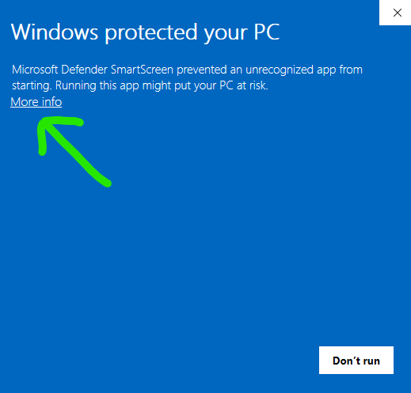
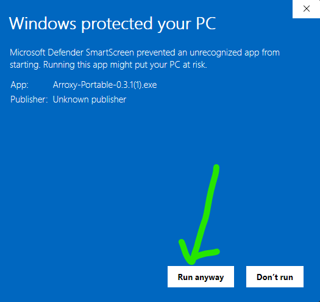

<div align="center">
  

# Arroxy — Windows, macOS va Linux uchun Bepul Ochiq Manbali YouTube (+ 2000 sayt) Yuklovchi

**4K · 1080p60 · HDR · Playlists · MP3 · Shorts · Music · Channels · Subtitles · SponsorBlock · +2000 sites**

**O'qing:** [Afaan Oromoo](README.om.md) · [Deutsch](README.de.md) · [English](README.md) · [Español](README.es.md) · [Français](README.fr.md) · [Kiswahili](README.sw.md) · **O'zbekcha** · [Tiếng Việt](README.vi.md) · [አማርኛ](README.am.md) · [العربية](README.ar.md) · [اردو](README.ur.md) · [پښتو](README.ps.md) · [বাংলা](README.bn.md) · [हिन्दी](README.hi.md) · [မြန်မာဘာသာ](README.my.md) · [Ελληνικά](README.el.md) · [Русский](README.ru.md) · [Српски](README.sr.md) · [Українська](README.uk.md) · [中文](README.zh.md) · [日本語](README.ja.md)

[](https://github.com/antonio-orionus/Arroxy/releases/latest) [](https://github.com/antonio-orionus/Arroxy/actions/workflows/release.yml) [](https://arroxy.orionus.dev/)   

**YouTube va 2000+ qo'llab-quvvatlanadigan saytlardan** videolar, Shorts, musiqa, kanallar, podkastlar yoki audio treklarni yuklab oling — 60 fps da 4K HDR gacha yoki MP3 / AAC / Opus sifatida. Windows, macOS va Linuxda mahalliy ishlaydi. **Reklamalar yo'q, keraksiz narsalar yo'q, qo'shimcha taklif yo'q.**

[**↓ Oxirgi Relizni Yuklab Olish**](../../releases/latest) &nbsp;·&nbsp; [**Veb-sayt**](https://arroxy.orionus.dev/) &nbsp;·&nbsp; [Windows](#download) · [macOS](#download) · [Linux](#download)


Agar Arroxy vaqtingizni tejasa, ⭐ boshqalarga topishga yordam beradi.

</div>

---

## Mundarija

- [Nima uchun Arroxy](#why)
- [Xususiyatlar](#features)
- [Yuklab olish](#download)
- [Maxfiylik](#privacy)
- [Ko'p so'raladigan savollar](#faq)
- [Yo'l xaritasi](#roadmap)
- [Qurish texnologiyalari](#tech)

---

## <a id="why"></a>Nima uchun Arroxy

Eng keng tarqalgan muqobillar bilan yon-yon taqqoslash:

|            | Arroxy | 4K Video Downloader | JDownloader | Y2Mate / online converters | Browser extensions |
| ---------- | :----: | :-----------------: | :---------: | :------------------------: | :----------------: |
| Bepul, premium daraja yo'q |   ✅   |         ⚠️          |     ✅      |             ⚠️             |         ⚠️         |
| Ochiq manba |   ✅   |         ❌          |     ❌      |             ❌             |         ⚠️         |
| Faqat mahalliy qayta ishlash |   ✅   |         ✅          |     ✅      |             ❌             |         ✅         |
| Kirish yoki kuki eksporti yo'q |   ✅   |         ⚠️          |     ⚠️      |             ⚠️             |         ✅         |
| Foydalanish chegaralari yo'q |   ✅   |         ⚠️          |     ✅      |             🚫             |         ⚠️         |
| Platformalararo desktop ilovasi |   ✅   |         ✅          |     ✅      |            N/A             |         ❌         |
| Subtitrlar + SponsorBlock |   ✅   |         ⚠️          |     ❌      |             ❌             |         ❌         |

Arroxy bir narsa uchun yaratilgan: URL'ni joylashtiring, toza mahalliy fayl oling. Hisoblar yo'q, qo'shimcha takliflar yo'q, ma'lumot to'plash yo'q.

---

## <a id="features"></a>Xususiyatlar

### Sifat va formatlar

- **4K UHD (2160p)**, 1440p, 1080p, 720p, 480p, 360p gacha
- **Yuqori kadr tezligi** o'zgarmagan holda saqlanadi — 60 fps, 120 fps, HDR
- **Faqat audio** ni MP3, M4A/AAC, Opus yoki WAV ga eksport qilish
- Tezkor sozlamalar: *Eng yaxshi sifat* · *Muvozanatli* · *Kichik fayl*

### Maxfiylik va nazorat

- 100% mahalliy qayta ishlash — yuklamalar YouTube'dan to'g'ridan-to'g'ri diskingizga boradi
- Kirish yo'q, kukilar yo'q, Google hisob bog'liq emas
- Fayllar siz tanlagan papkaga to'g'ridan-to'g'ri saqlanadi

### Ish oqimi

- **Istalgan havolani joylashtiring** — YouTube videolari, Shorts, kanallar, pleylistlar, podkastlar va Musiqa, hamda yt-dlp qo’llab-quvvatlaydigan 2000+ boshqa saytlar; butun pleylistni yuklab oling yoki avval aniq videolarni tanlang
- **Ko'p yuklab olish navbati** — bir nechta yuklamalarni parallel kuzatib boring
- **Bufer kuzatish** — YouTube havolasini nusxalang va Arroxy ilovaga qaytganingizda URL'ni avtomatik to'ldiradi (Kengaytirilgan sozlamalarda o'chirish/yoqish mumkin)
- **URL'larni avtomatik tozalash** — kuzatish parametrlarini olib tashlaydi (`si`, `pp`, `utm_*`, `fbclid`, `gclid`) va `youtube.com/redirect` havolalarini ochadi
- **Tray rejimi** — oynani yopish yuklamalarni fon rejimida davom ettiradi
- **21 til** — tizim tilini avtomatik aniqlaydi, istalgan vaqt almashtirish mumkin

### Subtitrlar va keyingi qayta ishlash

- **Subtitrlar** SRT, VTT yoki ASS formatida — qo'lda yoki avtomatik yaratilgan, istalgan mavjud tilda
- Video yoniga saqlash, `.mkv` ichiga joylashtirish yoki `Subtitles/` pastki papkasiga tartibga solish
- **SponsorBlock** — homiylar, kirishlar, xotimalar, o'z reklamalarini o'tkazib yuborish yoki bo'limga belgilash
- **Joylashtirilgan metadata** — sarlavha, yuklash sanasi, kanal, tavsif, miniatyura va bob belgilari faylga yoziladi

### YouTube + 2000 sayt

- **YouTube to'liq** — Videolar, Shorts, Kanallar, Pleylistlar, YouTube Music va Podkastlar birinchi darajali manbalar sifatida ishlaydi
- **2000+ boshqa saytlar** yt-dlp orqali — Vimeo, Twitch, Twitter/X, TikTok, SoundCloud, Bandcamp, Bilibili, BBC iPlayer, archive.org va boshqalar
- **Faqat audio va subtitrlar** har qanday qo'llab-quvvatlanadigan saytda ishlaydi, nafaqat YouTube'da
- Sayt o'zgarsa, yt-dlp har hafta tuzatishlar chiqaradi va Arroxy ishga tushganda binarni avtomatik yangilaydi

<div align="center">
  
  
  <br/>
  
  
  <br/>
  
</div>

---

## <a id="download"></a>Yuklab olish

| Platforma | Format   |
| ------------------- | ------------------- |
| Windows             | O'rnatuvchi (NSIS) yoki Portable `.exe`   |
| macOS               | `.dmg` (Intel + Apple Silicon)   |
| Linux               | `.AppImage` yoki `.flatpak` (qumloq muhitda) |

[**Oxirgi relizni oling →**](../../releases/latest)

### <a id="why-warning"></a>Nima uchun ogohlantirish ko'rishingiz mumkin

Arroxy ochiq manbali va MIT litsenziyali. Windows va macOS qurilmalari **kod imzolanmagan** — Apple Developer ID va Windows EV kod imzolash sertifikatlari har biri yiliga yuzlab dollarga tushadi, buni mustaqil loyiha o'z hisobidan to'laydi. Bu imzolarsiz, Windows SmartScreen va macOS Gatekeeper birinchi ishga tushirishda ogohlantiradi. Ogohlantirishlar *operatsion tizimingiz nashriyotchini tanib olmasligini* anglatadi — bu Arroxy zararli dastur ekanligini anglatmaydi.

Arroxy ni o'zingiz tekshirishning uch yo'li, ortib boruvchi qat'iylikda:

- **Manbani o'qing.** Har bir satr [GitHub](https://github.com/antonio-orionus/Arroxy) da mavjud va siz [manbadan yaratishingiz](#tech) mumkin.
- **SHA256 ni tekshiring.** Faylingizni e'lon qilingan [`SHA256SUMS`](../../releases/latest) bilan solishtiring — pastdagi [Yuklab olishingizni tekshiring](#verify) ga qarang.
- **Uchinchi tomon skanini o'tkazing.** Faylni [VirusTotal](https://www.virustotal.com) ga yuklang.

### <a id="windows-first-launch"></a>Windows da birinchi ishga tushirish

Birinchi ishga tushirishda **"Windows protected your PC"** yoki **"Unknown publisher"** xabarini ko'rishingiz mumkin. Bu `Arroxy-Setup-*.exe` va `Arroxy-Portable-*.exe` ikkisiga ham tegishli. Arroxy bepul va ochiq manbali dastur bo'lib, Windows qurilmalari pulli sertifikat bilan imzolanmagan, shuning uchun SmartScreen ularni belgilaydi. Bu Arroxy xavfli ekanligini **avtomatik ravishda** anglatmaydi. Davom etish uchun:

<div align="center">
  
  
</div>

1. **More info** tugmasini bosing.
2. **Run anyway** tugmasini bosing.

#### Windows Defender fayl ni belgilasa yoki olib tashlasa

Defender evristikasi ba'zida imzalanmagan NSIS o'rnatuvchilari va Electron portableni shubhali deb belgilaydi. Agar Defender `Arroxy-Setup-*.exe` yoki `Arroxy-Portable-*.exe` ni karantinga olsa, uni **Windows Security → Virus & threat protection → Protection history** dan qayta tiklang, so'ng Arroxy bajariladigan faylini **Manage settings → Add or remove exclusions** ostida ruxsat etilgan element sifatida qo'shing. SmartScreen singari, bu ham aniqlanmagan zararli dastur emas, balki etishmayotgan nashriyotchi imzosi sababli yuzaga keladi.

> Arroxy'ni faqat rasmiy GitHub Releases sahifasidan yuklab oling. Agar faylni boshqa saytdan olgan bo'lsangiz yoki kimdir sizga yuborgan bo'lsa, uni o'chirib, rasmiy manbadan yangi nusxa yuklab oling. Manba kodi ommaviy, shuning uchun xohlasangiz o'zingiz tekshirishingiz yoki Arroxy'ni mustaqil qurishingiz mumkin.

### <a id="macos-first-launch"></a>macOS da birinchi ishga tushirish

Arroxy hali macOS uchun kod imzolanmagan, shuning uchun Gatekeeper birinchi ishga tushirishni bloklaydi. Uni ruxsat etishning aniq yo'li macOS versiyangizga bog'liq — Sequoia 15 eski sichqonchaning o'ng tugmasi → Open usulini qattiqlashtirib qo'ydi.

#### macOS Sequoia 15 va undan keyingi (joriy)

Sequoia 15 va undan yangi versiyalarda, sichqonchaning o'ng tugmasi → Open ko'plab karantindagi ilovalar uchun Gatekeeper ni chetlab o'tmaydi. Buning o'rniga Tizim Sozlamalari panelidan foydalaning:

1. O'rnatilgan DMG dan `Arroxy.app` ni `/Applications` ga torting.
2. Arroxy ni ikki marta bosing. Bloklash dialogi paydo bo'ladi — **Done** tugmasini bosing (*Move to Trash* ni bosmang).
3. **System Settings → Privacy & Security** ni oching va **Security** bo'limiga suring. Siz *"Arroxy was blocked to protect your Mac"* (yoki shunga o'xshash xabar) ko'rasiz.
4. **Open Anyway** tugmasini bosing, parolingiz yoki Touch ID bilan tasdiqlang, so'ng Arroxy ni `/Applications` dan qayta ishga tushiring.

#### macOS Sonoma 14 va undan oldingi

1. O'rnatilgan DMG dan `Arroxy.app` ni `/Applications` ga torting.
2. `/Applications` dagi `Arroxy.app` ga sichqonchaning o'ng tugmasi bilan bosing (yoki Control-click) va **Open** ni tanlang.
3. Ogohlantirish dialogida endi **Open** tugmasi bor — uni bosing va tasdiqlang. Arroxy odatda ochiladi va ogohlantirish boshqa ko'rinmaydi.

#### "App is damaged" yoki doimiy Gatekeeper bloki — Terminal orqali tuzatish

Agar macOS *"Arroxy is damaged and can't be opened"* desa, yoki yuqoridagi qadamlarning hech biri blokni bartaraf etmasa, DMG dagi karantin atributi sabab (ba'zi brauzerlar va macOS ning o'zining translokatsiya xatti-harakati uni o'rnatadi). O'rnatilgan ilovadan uni o'chirib tashlang:

```bash
xattr -dr com.apple.quarantine /Applications/Arroxy.app
```

**Apple Silicon va Intel:** M seriyali Mac da (M1 / M2 / M3 / M4) `arm64` DMG ni yuklab oling. Intel Mac larda `x64` DMG ni yuklab oling. Noto'g'ri qurilmani ishga tushirish Rosetta orqali ishlaydi, lekin sezilarli darajada sekinroq.

> macOS qurilmalari Apple Silicon va Intel runnerlarida CI orqali ishlab chiqariladi. Muammolarga duch kelsangiz, iltimos [muammo oching](../../issues) — macOS foydalanuvchilaridan qayta aloqa macOS test siklini faol shakllantiradi.

### <a id="linux-first-launch"></a>Linux da birinchi ishga tushirish

AppImagelar to'g'ridan-to'g'ri ishlaydi — o'rnatish shart emas. Faqat faylni bajariladigan sifatida belgilashingiz kerak.

**Fayl menejeri:** `.AppImage` ga sichqonchaning o'ng tugmasi bilan bosing → **Xususiyatlar** → **Ruxsatlar** → **Faylni dastur sifatida bajarishga ruxsat** ni yoqing, so'ng ikki marta bosing.

**Terminal:**

```bash
chmod +x Arroxy-*.AppImage
./Arroxy-*.AppImage
```

Agar ishga tushirish hali ham muvaffaqiyatsiz bo'lsa, FUSE etishmayotgan bo'lishi mumkin:

```bash
# Ubuntu / Debian
sudo apt install -y libfuse2

# Fedora
sudo dnf install -y fuse-libs

# Arch
sudo pacman -S fuse2
```

**Ixtiyoriy ish stoli integratsiyasi:** [AppImageLauncher](https://github.com/TheAssassin/AppImageLauncher) ni bir marta o'rnating va siz ikki marta bosgandagi har qanday AppImage avtomatik ravishda ishga tushiruvchi menyungizga ro'yxatdan o'tkaziladi — qo'lda `.desktop` fayli talab qilinmaydi.

**Flatpak (qumloq muhitdagi muqobil):** xuddi shu reliz sahifasidan `Arroxy-*.flatpak` ni yuklab oling.

```bash
flatpak install --user Arroxy-*.flatpak
flatpak run io.github.antonio_orionus.Arroxy
```

<details>
<summary><strong><a id="verify"></a>Yuklab olishingizni tekshiring (SHA256)</strong></summary>

Har bir reliz binarylar bilan birga `SHA256SUMS` faylini e'lon qiladi. Yuklab olishingiz tranzit davomida buzilmagan yoki o'zgartirilmaganligini tekshirish uchun faylingizni mahalliy ravishda hashlang va `SHA256SUMS` dagi satr bilan solishtiring. Oxirgi reliz sahifasini oching → **Assets** → `SHA256SUMS` ni yuklab oling.

**Windows (PowerShell yoki Command Prompt):**

```powershell
certutil -hashfile Arroxy-Setup-<version>.exe SHA256
```

**macOS (Terminal):**

```bash
shasum -a 256 Arroxy-<version>-arm64.dmg
```

**Linux (Terminal):**

```bash
sha256sum Arroxy-*.AppImage
```

Uchinchi tomon zararli dastur skanini istaysizmi? Faylni [VirusTotal](https://www.virustotal.com) da yuklang. Kichik vositalardan bir nechta umumiy evristik belgilash imzalanmagan Electron ilovalar uchun odatiy holat; yirik vositalardan keng tarqalgan aniqlanishlar haqiqiy muammo bo'lar edi.

</details>

<details>
<summary><strong>Paket menejeri orqali o'rnatish</strong></summary>

Paket menejeri allaqachon ishlatayapsizmi? Qo'lda yuklab olish yo'lidan o'tishingiz shart emas.

| Kanal | Buyruq                                                                                |
| ------------------ | ------------------------------------------------------------------------------------------------- |
| Winget             | `winget install AntonioOrionus.Arroxy`                                                            |
| Scoop              | `scoop bucket add arroxy https://github.com/antonio-orionus/scoop-bucket && scoop install arroxy` |
| Homebrew           | `brew tap antonio-orionus/arroxy && brew install --cask arroxy`                                   |
| Flatpak            | `flatpak install --user Arroxy-*.flatpak`                                                         |

</details>

<details>
<summary><strong>Windows: O'rnatuvchi va Portable taqqoslash</strong></summary>

|               | NSIS O'rnatuvchi | Portable `.exe` |
| ------------- | :----------------------: | :---------------------: |
| O'rnatish talab qilinadi | Ha  | Yo'q — istalgan joydan ishga tushiring  |
| Avtomatik yangilanishlar | ✅ ilova ichida  | ❌ qo'lda yuklab olish  |
| Ishga tushish tezligi | ✅ tezroq  | ⚠️ sekinroq sovuq ishga tushish  |
| Boshlash menyusiga qo'shadi |            ✅            |           ❌            |
| Oson o'chirish |            ✅            | ❌ faylni o'chirish  |

**Tavsiya:** avtomatik yangilanishlar va tezroq ishga tushish uchun NSIS o'rnatuvchisidan foydalaning. O'rnatishsiz, reyestrg'a ta'sir qilmaydigan variant uchun portable `.exe` dan foydalaning.

</details>

---

## <a id="privacy"></a>Maxfiylik

Yuklamalar YouTube'dan siz tanlagan papkaga to'g'ridan-to'g'ri [yt-dlp](https://github.com/yt-dlp/yt-dlp) orqali olinadi — hech narsa uchinchi tomon server orqali yo'naltirilmaydi. Ko'rish tarixi, yuklab olish tarixi, URL'lar va fayl mazmunlari qurilmangizda qoladi.

Arroxy [OpenPanel](https://openpanel.dev) orqali anonim, agregat telemetriya yuboradi — ishga tushirishlar, OS, ilova versiyalari va nosozliklarni tushunish uchun yetarli. URL, video sarlavhasi, fayl yo‘li, hisob ma’lumoti, fingerprinting yoki shaxsiy ma’lumot yo‘q. Har bir o‘rnatish IDsi tasodifiy va shaxsingizga bog‘lanmagan. Sozlamalarda o‘chirib qo‘yishingiz mumkin.

---

## <a id="faq"></a>Ko'p so'raladigan savollar

**Bu haqiqatan ham bepulmi?**
Ha — MIT litsenziyalangan, premium daraja yo'q, xususiyat cheklash yo'q.

**Qanday video sifatlarini yuklab olishim mumkin?**
YouTube uzatadigan har qanday narsa: 4K UHD (2160p), 1440p, 1080p, 720p, 480p, 360p va faqat audio. 60 fps, 120 fps va HDR oqimlari o'zgarmagan holda saqlanadi.

**Faqat audioni MP3 sifatida chiqarib olishim mumkinmi?**
Ha. Format menyusidan *faqat audio* ni tanlang va MP3, M4A/AAC, Opus yoki WAV ni belgilang.

**YouTube hisob yoki kukilar kerakmi?**
Standart holatda — yo'q. Arroxy YouTube hisobi, tizimga kirish yoki kuki eksportisiz ishlaydi. Autentifikatsiya talab qiladigan kontent (masalan, yosh chegarasi qo'yilgan yoki faqat a'zolar uchun videolar) uchun Kengaytirilgan sozlamalarda ixtiyoriy kuki qo'llab-quvvatlash mavjud (Cookies source: file or browser). Standart holatda u o'chirilgan. Agar uni yoqsangiz, yt-dlp wiki sahifasida [kuki asosidagi avtomatlashtirish Google hisobini belgilashi mumkinligi haqida ogohlantirish berilgan](https://github.com/yt-dlp/yt-dlp/wiki/Extractors#exporting-youtube-cookies); bunday holatda bir martalik hisob xavfsizroq tanlovdir.

**YouTube nimadir o'zgartirsa ham ishlashda davom etadimi?**
yt-dlp ishga tushirishda avtomatik yangilanadi, va YouTube biror narsani o'zgartirganda Arroxy tezlik bilan tuzatishlarni chiqaradi. Agar siz biron muammoga duch kelsangiz, Kengaytirilgan sozlamalarda ixtiyoriy kuki qo'llab-quvvatlash zaxira variant sifatida mavjud.

**Arroxy qanday tillarda mavjud?**
Yigirma bir, darhol tayyor: English, Español (ispan), Deutsch (nemis), Français (frantsuz), 日本語 (yapon), 中文 (xitoy), Русский (rus), Українська (ukrain), हिन्दी (hind), Afaan Oromoo, Kiswahili, O'zbekcha (o'zbek), Tiếng Việt (vyetnam), አማርኛ (amxar), العربية (arab), اردو (urdu), پښتو (pushtu), বাংলা (bengal), မြန်မာဘာသာ (birma), Ελληνικά (grek) va Српски (serb). Arroxy birinchi ishga tushirishda operatsion tizimingiz tilini avtomatik aniqlaydi va siz istalgan vaqtda asboblar panelindagi til tanlagichidan o'zgartirishingiz mumkin. Tarjimalar src/shared/i18n/locales/ ichidagi oddiy TypeScript obyektlari sifatida saqlanadi — hissa qo'shish uchun GitHub'da PR oching.

**Boshqa narsalarni o'rnatishim kerakmi?**
Yo‘q. yt-dlp birinchi ishga tushirishda avtomatik yuklab olinadi va kompyuteringizda keshlanadi; ffmpeg va ffprobe ilova bilan birga keladi. Undan keyin qo‘shimcha sozlash shart emas.

**Playlist yoki butun kanallarni yuklab olishim mumkinmi?**
Ha, playlistlar uchun: playlist URL manzilini joylang, keyin butun ro‘yxatni yoki faqat tanlagan videolaringizni navbatga qo‘shing. Butun kanalni to‘plam holida yuklab olish hali qo‘llab-quvvatlanmaydi.

**macOS "ilova shikastlangan" deydi — nima qilaman?**
Bu macOS Gatekeeper imzalanmagan ilovani bloklayotgani, haqiqiy shikastlanish emas. Bir qatorli `xattr` buyrug'i haqida ["App is damaged" — Terminal orqali tuzatish](#macos-first-launch) ga qarang.

**YouTube videolarini yuklab olish qonuniyimi?**
Shaxsiy, xususiy foydalanish uchun bu ko'pchilik yurisdiktsiyalarda umumiy qabul qilingan. Siz YouTube ning [Foydalanish Shartlari](https://www.youtube.com/t/terms) va mahalliy mualliflik huquqi qonunlariga rioya qilish uchun javobgarsiz.

---

## <a id="roadmap"></a>Yo'l xaritasi

Kelayotgan — taxminan ustuvorlik tartibida:

| Xususiyat    | Tavsif    |
| ---------------- | ---------------- |
| **Toplu URL kiritish** | Bir vaqtning o'zida bir nechta URL'larni joylashtiring va ularni bitta yugurishda bajaring |
| **Maxsus fayl nomi shablonlari** | Fayllarni sarlavha, yuklovchi, sana, aniqlik bo'yicha nomlash — jonli ko'rinish bilan |
| **Rejalashtirilgan yuklab olishlar** | Navbatni belgilangan vaqtda boshlash (tunda ishlash) |
| **Tezlik cheklovlari** | Yuklamalar ulanishingizni to'liq egallab olmasligi uchun o'tkazish qobiliyatini cheklash |
| **Klip qirqish** | Boshlash/tugash vaqti bo'yicha faqat bir segmentni yuklab olish |

Xayyolizda xususiyat bormi? [So'rov yuboring](../../issues) — jamiyat ishtiroki ustuvorlikni belgilaydi.

---

## <a id="tech"></a>Qurish texnologiyalari

<details>
<summary><strong>Stack</strong></summary>

- **Electron** — platformlararo desktop qobig'i
- **React 19** + **TypeScript** — UI
- **Tailwind CSS v4** — stilizatsiya
- **Zustand** — holat boshqaruvi
- **yt-dlp** + **ffmpeg** — yuklab olish va mux mexanizmi (yt-dlp runtime’da olinadi; ffmpeg/ffprobe build vaqtida qo‘shiladi)
- **Vite** + **electron-vite** — qurish vositalari
- **Vitest** + **Playwright** — birlik va uchdan-uchgacha testlar

</details>

<details>
<summary><strong>Manba koddan qurish</strong></summary>

### Talablar — barcha platformalar uchun

| Vosita | Versiya | O'rnatish |
| ------ | ------- | --------- |
| Git    | istalgan | [git-scm.com](https://git-scm.com) |
| Bun    | oxirgi  | quyidagi OT bo'yicha ko'ring |

### Windows

```powershell
powershell -c "irm bun.sh/install.ps1 | iex"
```

Mahalliy qurish vositalari talab qilinmaydi — loyihada mahalliy Node qo'shimchalari yo'q.

### macOS

```bash
xcode-select --install
curl -fsSL https://bun.sh/install | bash
```

### Linux (Ubuntu / Debian)

```bash
curl -fsSL https://bun.sh/install | bash

# Electron ish vaqti bog'liqliklari
sudo apt install -y libgtk-3-0 libnss3 libasound2t64

# Faqat E2E testlar uchun (Electron displeyni talab qiladi)
sudo apt install -y xvfb
```

### Klonlash va ishga tushirish

```bash
git clone https://github.com/antonio-orionus/Arroxy
cd arroxy
bun install
bun run dev          # issiq qayta yuklash bilan dev qurish
```

### Tarqatish paketini qurish

```bash
bun run build        # turni tekshirish + kompilyatsiya
bun run dist         # joriy OT uchun paketlash
bun run dist:win     # Windows portable exe ni cross-kompilyatsiya qilish
```

> yt-dlp birinchi ishga tushirishda GitHub’dan olinadi va ilova ma’lumotlari papkasida keshlanadi. ffmpeg va ffprobe har bir Arroxy relizi bilan birga keladi.

</details>

---

## <a id="troubleshooting"></a>Troubleshooting

### App won't open / no window appears

The Arroxy process starts but no window shows up. Most often this is a GPU driver hang during startup. Try, in order:

**1. Check the log.** It records startup, GPU info, and any crash. Path:

| Platform | Path                                              |
| -------- | ------------------------------------------------- |
| Windows  | `%APPDATA%\Arroxy\logs\main.log`                  |
| macOS    | `~/Library/Logs/Arroxy/main.log`                  |
| Linux    | `~/.config/Arroxy/logs/main.log`                  |

**2. Launch with hardware acceleration disabled.** Open a terminal / Command Prompt and run the executable with a flag:

```bash
# Windows (Portable) — PowerShell, run from the folder containing the exe
.\Arroxy-Portable-<version>.exe --disable-gpu

# Windows (Portable) — Command Prompt (cmd.exe), from the same folder
Arroxy-Portable-<version>.exe --disable-gpu

# Windows (Installed) — works in both PowerShell and cmd.exe
"%LOCALAPPDATA%\Programs\Arroxy\Arroxy.exe" --disable-gpu

# macOS
/Applications/Arroxy.app/Contents/MacOS/Arroxy --disable-gpu

# Linux (AppImage)
./Arroxy-*.AppImage --disable-gpu
```

If that works, the GPU/driver is the cause. Make the change permanent (next step).

**3. Persist the flag via `argv.json`.** Create the file at:

| Platform | Path                                          |
| -------- | --------------------------------------------- |
| Windows  | `%APPDATA%\Arroxy\argv.json`                  |
| macOS    | `~/Library/Application Support/Arroxy/argv.json` |
| Linux    | `~/.config/Arroxy/argv.json`                  |

With contents:

```json
{ "disable-hardware-acceleration": true }
```

Arroxy reads this before opening any window, so it works even when the window never appeared.

**4. Other flags worth trying** (combine if needed): `--disable-software-rasterizer`, `--disable-gpu-sandbox`, `--in-process-gpu`.

**5. Stale window position.** If the window may be opening off-screen (multi-monitor change since last run), delete `<userData>\window-state.json` and relaunch.

**6. Still stuck?** Open an issue with: OS version, the contents of `main.log`, and any output from running with `--enable-logging --v=1`.

---

## Foydalanish shartlari

Arroxy faqat shaxsiy, xususiy foydalanish uchun mo'ljallangan vosita. Siz yuklab olishlaringiz YouTube ning [Foydalanish Shartlari](https://www.youtube.com/t/terms) va yurisdiktsiyangizning mualliflik huquqi qonunlariga muvofiqligini ta'minlash uchun yagona javobgarsiz. Arroxy ni foydalanish huquqingiz bo'lmagan kontentni yuklab olish, ko'paytirish yoki tarqatish uchun ishlatmang. Ishlab chiquvchilar har qanday suiiste'mollik uchun javobgar emas.

<div align="center">
  <sub>MIT Litsenziyasi · <a href="https://x.com/OrionusAI">@OrionusAI</a> tomonidan mehnat bilan yaratilgan</sub>
</div>
